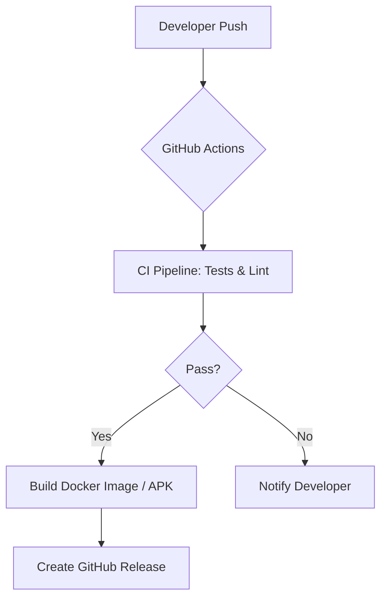

# DevOps Architecture & CI/CD Pipeline

## 1. Overview
This project implements a complete DevOps lifecycle for the **Plant Disease Detection App**. It includes automated testing, containerization, and a release strategy using GitHub Actions.

## 2. Technology Stack
- **Version Control**: Git & GitHub
- **CI/CD**: GitHub Actions
- **Containers**: Docker & Docker Compose
- **Security**: Trivy (Vulnerability Scanning), Flake8 (Linting)
- **Database**: MongoDB (Service Container for Integration Tests)
- **Monitoring**: Health check endpoints & logging

## 3. CI/CD Architecture
The pipeline is split into three main workflows to ensure speed and reliability.

### Backend CI Pipeline
1. **Linting**: Static code analysis using `flake8`.
2. **Unit Tests**: FastAPI unit tests with `pytest`.
3. **Integration Tests**: Tests against a live MongoDB 6.0 service container.
4. **Security Scan**: Vulnerability scanning of the codebase.

### Frontend CI Pipeline
1. **Static Analysis**: `flutter analyze` and `dart format`.
2. **Unit Tests**: Flutter unit and widget tests.
3. **Build Check**: Verification of web build success.

### Production Release
1. **Dockerization**: Backend is packaged into a production-ready Docker image.
2. **Android Build**: Frontend is compiled into a release APK.
3. **Automated Release**: APK is attached to a new GitHub Release automatically.

## 4. Implementation Details

### Infrastructure as Code (IaC)
We use `docker-compose.yml` to define the entire application stack:
- **Backend**: FastAPI service.
- **Database**: MongoDB 7.0 with persistent volumes.
- **Cache**: Redis 7.0 for session management.

### Secrets Management
Sensitive data like `MONGODB_URL` and `SECRET_KEY` are managed via:
- **Local**: `.env` files (git-ignored).
- **CI/CD**: GitHub Repository Secrets.

### Rollback Strategy
Every release is tagged with a version (e.g., `v1.0.0`). To rollback, we simply re-deploy the previous Docker image or re-run the previous successful Action.

## 5. Deployment Flow

