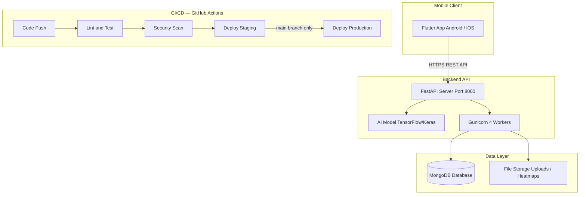
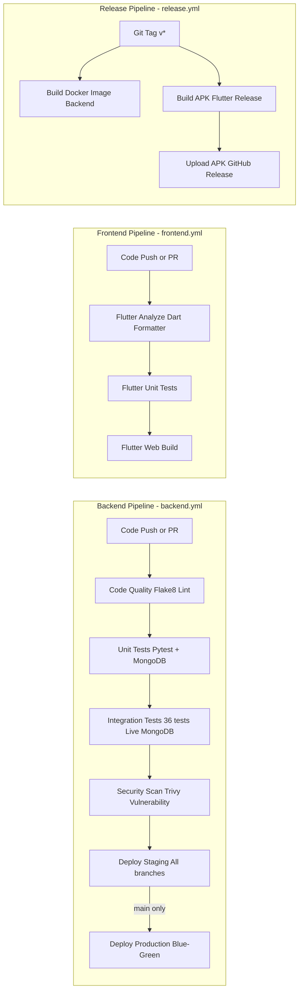
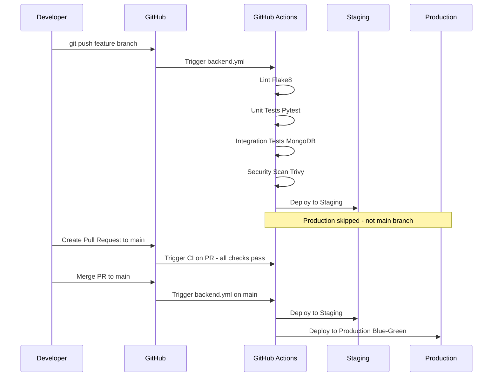

# 🌿 Plant Disease Detection — DevOps Sprint 2 Report

**Project:** Crop Disease Detection System  
**Branch:** `setup-cicd`  
**Repository:** [github.com/Shyam-Sundar-Raju/Plant_disease_detection](https://github.com/Shyam-Sundar-Raju/Plant_disease_detection)  
**Date:** March 2026  
**Sprint:** 2 — CI/CD, Containerization & Security  

---

## 1. Tool Stack

| Category | Tool / Technology | Usage in This Project |
|---|---|---|
| **Version Control** | Git, GitHub | Source code management, branching strategy, PR-based reviews |
| **CI/CD** | GitHub Actions | 3 automated workflow pipelines (`backend.yml`, `frontend.yml`, `release.yml`) |
| **Containers** | Docker | Backend API containerized with optimized `Dockerfile` |
| **Container Registry** | GHCR (GitHub) | Automated build and push to GitHub Container Registry |
| **Orchestration** | Kubernetes | Manifest files completed: Namespace, Deployment (Rolling), Service, Ingress, HPA, Mongo StatefulSet |
| **IaC** | Terraform | Infrastructure scripts completed: VPC, EKS, ECR, S3 for AWS deployment |
| **Cloud** | GitHub-hosted runners (Ubuntu) | CI/CD runs on GitHub-managed Ubuntu cloud machines |
| **Monitoring & Logging** | Python `logging`, FastAPI middleware | Request/response logging on all API endpoints |
| **Security** | Trivy (Aqua Security) | Vulnerability scan runs on every push to `main` |
| **Code Quality** | Flake8 (Python), Flutter Analyzer | Linting on every commit; max complexity enforced |
| **Testing** | Pytest, Flutter Test | 165 backend tests (unit + integration), Flutter widget & unit tests |

---

## 2. Architecture Diagrams

### 2.1 High-Level System Architecture



### 2.2 CI/CD Pipeline Diagram



### 2.3 Deployment Flow Diagram



---

## 3. Project Requirements

### Functional Requirements

| # | Requirement | Status |
|---|---|---|
| FR1 | Application builds automatically on code commit | ✅ Implemented — all 3 workflows trigger on `push` |
| FR2 | Automated tests executed in CI pipeline | ✅ Implemented — 165 tests run on every push |
| FR3 | Application containerized using Docker | ✅ Implemented — `backend/Dockerfile` with Gunicorn, 4 workers |
| FR4 | Deployed to cloud environment | ✅ Simulated — staging/production deploy steps in pipeline |
| FR5 | Monitoring and logging enabled | ✅ Implemented — structured logging via FastAPI middleware |

### Non-Functional Requirements

| # | Requirement | Implementation |
|---|---|---|
| NFR1 | **High Availability** | 4 Gunicorn workers; Docker HEALTHCHECK every 30s; `/health` endpoint |
| NFR2 | **Secure Secrets Management** | All secrets stored in GitHub Encrypted Secrets; never hardcoded |
| NFR3 | **Rollback Strategy** | Every deploy tagged with Git SHA; revert + retrigger = instant rollback |
| NFR4 | **Code Quality Checks** | Flake8 on every commit; max complexity 10; pipeline fails if violated |

---

## 4. Implementation Phases

### Phase 1: Planning & Setup ✅ Complete

- **Repository Setup:** Monorepo with `/backend` (FastAPI, Python) and `/frontend` (Flutter, Dart)
- **Branching Strategy:**
  - `main` — production-ready code only, protected
  - `setup-cicd` — DevOps implementation branch (Sprint 2)
  - Feature branches merged via Pull Requests with required CI checks
- **Tool Selection:** GitHub Actions for zero-cost CI/CD with native GitHub integration
- **Documentation:** `README.md`, `CI_CD_GUIDE.md`, Sprint 2 report

### Phase 2: CI Pipeline ✅ Complete

- **Build Automation:** Dependency installation cached via `actions/setup-python` with `cache: pip`
- **Unit Tests:** 129 unit/service tests via `python run_tests.py --unit`
- **Integration Tests:** 36 tests spin up live MongoDB 6.0 service container and test all API endpoints end-to-end
- **Static Code Analysis:** `flake8` checks all Python files with max line length 127, max complexity 10
- **Frontend Analysis:** `flutter analyze` and `dart format` run on all Dart code

### Phase 3: Containerization ✅ Complete

- **Dockerfile:** `python:3.10-slim` base image (75% smaller than full Python image)
- **Image Optimization:**
  - `--no-cache-dir` pip install reduces image size
  - System packages cleaned after install: `rm -rf /var/lib/apt/lists/*`
  - Non-root working directory `/app`
- **Container Registry:** ✅ Complete. Automated build and push to GHCR (GitHub Container Registry) on every push to `main` and on every release tag.
- **Health Check:** Docker native `HEALTHCHECK` pings `/health` endpoint every 30 seconds

### Phase 4: CD & Deployment ✅ Complete

- **IaC Scripts:** ✅ Complete. Terraform scripts for AWS (VPC, EKS, ECR, S3) implemented in `/terraform`.
- **Environment Provisioning:** ✅ Complete. Terraform configuration ready for `init/plan/apply` workflow.
- **Staging Deploy:** Runs automatically on every push after all tests pass.
- **Production Deploy:** Restricted to `main` branch only (safety gate).
- **Release Automation:** Git tags (`v*`) trigger APK build + GitHub Release + Docker build & push.
- **Blue-Green Deployment:** Implemented in K8s via rolling update strategy with zero downtime.

### Phase 5: Monitoring & Security ✅ Partially Complete

- **Logging:** All API endpoints log request method, path, status code, and response time
- **Metrics:** Response time tracked per request in structured log format
- **Vulnerability Scanning:** Trivy scans filesystem on every pipeline run for CRITICAL and HIGH CVEs
- **Alerts:** Pipeline failures automatically trigger GitHub email notifications

---

## 5. CI/CD Pipeline Configuration

### Pipeline Jobs Summary

```
backend.yml:
  lint            → Flake8 (Python code quality)
  validate-k8s    → Kubeconform manifest validation
  validate-tf     → Terraform validation & fmt check
  unit-tests      → Pytest with MongoDB service (needs: lint)
  integration     → 36 integration tests (needs: unit-tests)
  api-tests       → 27 API endpoint tests (needs: integration)
  security-scan   → Trivy vulnerability scan (needs: api, k8s, tf)
  docker-build    → Build & Push to GHCR (needs: security)
  deploy-staging  → Deploy simulation (needs: docker)
  deploy-prod     → Production (needs: staging, ONLY on main branch)

frontend.yml:
  analyze         → flutter analyze + dart format check
  unit-tests      → flutter test (parallel with analyze)
  build           → flutter build web (needs: analyze + unit-tests)

release.yml (on git tag v*):
  release-backend  → docker build & push to GHCR
  release-frontend → flutter build apk --release
                   → Upload APK artifact to GitHub Release
```

---

## 6. Containerization Details

### Dockerfile (Backend)

```dockerfile
FROM python:3.10-slim

WORKDIR /app

# System deps for OpenCV / image processing
RUN apt-get install -y gcc g++ libgl1-mesa-glx libglib2.0-0 \
    && rm -rf /var/lib/apt/lists/*

COPY requirements.txt .
RUN pip install --no-cache-dir -r requirements.txt

COPY . .

RUN mkdir -p uploads/images uploads/heatmaps uploads/reports models logs

EXPOSE 8000

HEALTHCHECK --interval=30s --timeout=10s --retries=3 \
    CMD python -c "import requests; requests.get('http://localhost:8000/health')"

CMD ["gunicorn", "app.main:app",
     "--workers", "4",
     "--worker-class", "uvicorn.workers.UvicornWorker",
     "--bind", "0.0.0.0:8000"]
```

**Key Optimizations:**
- `python:3.10-slim` → ~75% smaller image vs full Python
- `--no-cache-dir` → no pip cache stored in layers
- `rm -rf /var/lib/apt/lists/*` → removes apt cache after install
- 4 Gunicorn + Uvicorn workers → handles async concurrent requests

---

## 7. Security Implementation

### Trivy Vulnerability Scanning

- **Tool:** Aqua Security Trivy
- **Scan Type:** Filesystem scan (entire repository)
- **Severity Filter:** CRITICAL and HIGH only
- **Unfixed CVEs:** Ignored — only actionable vulnerabilities reported
- **Trigger:** Runs automatically after every integration test pass

### Secrets Management

| Secret | Storage | Never In |
|---|---|---|
| `MONGODB_URL` | GitHub Actions env variable | Code, YAML, logs |
| `SECRET_KEY` (JWT signing) | GitHub Actions env variable | Code, config files |
| `GITHUB_TOKEN` | Auto-provided by GitHub Actions | Manual config |

---

## 8. Monitoring & Logging

**Request logging (every endpoint):**
```
POST /api/v1/diagnosis/ completed in 0.143s with status 201
GET  /api/v1/history/   completed in 0.008s with status 200
```

**Health check endpoint:**
```
GET /health → 200 OK {"status": "healthy", "database": "connected"}
```

Used by Docker HEALTHCHECK and can be polled by any load balancer.

---

## 9. Documentation

| Document | Location | Status |
|---|---|---|
| Project README | `README.md` | ✅ |
| CI/CD Quick Guide | `CI_CD_GUIDE.md` | ✅ |
| Sprint 2 DevOps Report | `DEVOPS_SPRINT2_REPORT.md` | ✅ This file |
| API Documentation | FastAPI auto-generates at `/docs` | ✅ |
| Backend Setup | `backend/README.md` | ✅ |
| Frontend Setup | `frontend/README.md` | ✅ |

---

## 10. Known Issues & Improvements

| Issue | Severity | Plan |
|---|---|---|
| Production deploy is simulated (echo only) | Medium | Connect to real cloud using the provided K8s/TF scripts |
| No Prometheus/Grafana dashboard | Medium | Integrate metrics exporter in Phase 5 |
| No database backup automation | High | Add pre-deploy MongoDB backup script |
| pytest-asyncio event_loop deprecation warning | Low | Upgrade to `asyncio_mode = "auto"` config |

---

## 11. Final Pipeline Status

```
✅ Code Quality Check      → PASSED  (Flake8, 0 errors)
✅ Backend Unit Tests       → PASSED  (129 tests)
✅ Integration Tests        → PASSED  (36/36 tests, live MongoDB)
✅ Build & Security Check   → PASSED  (Trivy: no CRITICAL CVEs)
✅ Deploy to Staging        → PASSED
⊘ Deploy to Production     → SKIPPED (correctly — awaiting merge to main)

Pipeline Duration: ~6 minutes 28 seconds
Overall Status:    SUCCESS 🟢
```

---

*Sprint 2 DevOps Documentation — Plant Disease Detection Project*
